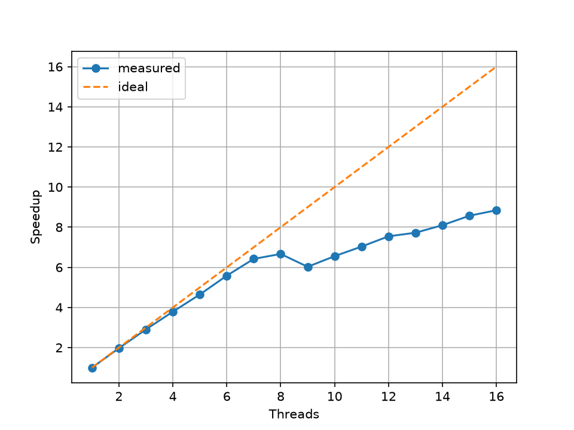

# Monte Carlo pi, multithreaded

Small experiment on C++ multithreading and CPU cache effects, using a Monte Carlo estimate of pi. It throws random points in a square, counts how many land in the circle, splits the work across threads and measures how much faster it gets.

## Build & run

```
g++ -O2 -Wall -std=c++20 main.cpp -o pi
./pi <points> <threads> <mode>
```

mode 1: each thread counts locally, writes once at the end
mode 2: each thread writes its counter in a shared vector at every hit (false sharing)
mode 3: same as 2 but every counter has its own 64 byte cache line
mode 4: one std::atomic counter for all threads

## Speedup

`./bench.sh` runs mode 1 with 1-16 threads (5 runs each), `python plott.py` makes the plot.



Ryzen 7 5800H, 8 cores / 16 threads. Almost linear until 8 threads. At 9 it drops because one core gets two threads and everyone waits for it. After that it grows slowly since threads share cores.

## Cache experiment

100M points:

| mode | 1 thread | 8 threads |
|---|---|---|
| 1 | 1.86 s | 0.26 s |
| 2 | 2.15 s | 0.51 s |
| 3 | 2.13 s | 0.30 s |
| 4 | 2.14 s | 1.14 s |

Modes 2 and 3 do the same writes, the only difference is the counters being on the same cache line or not, and with 8 threads that almost doubles the time. Mode 4 is the worst since all threads hit the same variable.
